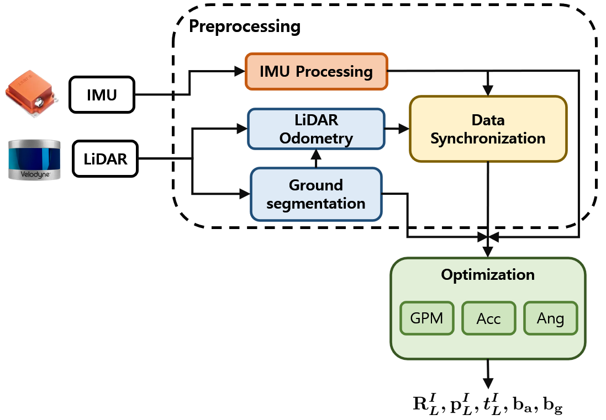

# GRIL-Calib
Official implementation of our paper **"GRIL-Calib: Targetless Ground Robot IMU-LiDAR Extrinsic Calibration Method using Ground Plane Motion Constraints"**.  

- ArXiv : [https://arxiv.org/abs/2312.14035](https://arxiv.org/abs/2312.14035)  
- IEEE : [https://ieeexplore.ieee.org/document/10506583](https://ieeexplore.ieee.org/document/10506583)  

## About GRIL-Calib
<p align="center"></p>  

- **GRIL-Calib** is the LiDAR-IMU calibration method for ground robots.
- Using only **planar motion**, the 6-DOF calibration parameter could be estimated.

## Prerequisites
- Ubuntu 18.04
- ROS Melodic
- PCL >= 1.8
- Eigen >= 3.3.4
- [livox_ros_driver](https://github.com/Livox-SDK/livox_ros_driver)
- [ceres-solver-2.0.0](http://ceres-solver.org/installation.html#linux)

### Set up your environment easily with Docker!  🐳  

**Requires [Docker](https://www.docker.com/) and the [NVIDIA Container Toolkit](https://docs.nvidia.com/datacenter/cloud-native/container-toolkit/latest/install-guide.html) installed.**

**1. Enter the `/docker` folder and make a docker image.**
```
git clone https://github.com/Taeyoung96/GRIL-Calib.git
```
```
cd GRIL-Calib/docker
```
```
docker build -t gril-calib .
```

When you have finished it, use the command `docker images` and you can see the output below.
```
REPOSITORY                   TAG                   IMAGE ID         CREATED          SIZE
gril-calib                   latest                9f90339349a0     5 months ago     3.78GB
```

**2. Make docker container (same path as above)**

In `/docker`,  
```
sudo chmod -R 777 container_run.sh
```
```
./container_run.sh <container_name> <image_name:tag>
```
**:warning: You should change {container_name}, {docker image} to suit your environment.**  

```
./container_run.sh gril-calib-container gril-calib:latest 
```

If you have successfully created the docker container, the terminal output will be similar to the below.
```
================Gril-Calib Docker Env Ready================
root@taeyoung-cilab:/root/catkin_ws#
```

**3. Build and run GRIL-Calib**

Inside the docker container, build and run the package.  
```
catkin_make
```
```
source devel/setup.bash
```

## Run with a public dataset  

The launch files for [M2DGR](https://ieeexplore.ieee.org/abstract/document/9664374), [HILTI](https://arxiv.org/abs/2109.11316), and [S3E](https://arxiv.org/abs/2210.13723), as experimented with in the paper, are shown below.

- For M2DGR,
```
roslaunch gril_calib m2dgr_xxxx.launch
```

- For HILTI,
```
roslaunch gril_calib hilti_xxxx.launch
```
- For S3E,
```
roslaunch gril_calib s3e_xxxx.launch
```

After running the launch file, you simply run the bag file for each sequence.  

## Run with your custom data

**:warning: This version only supports Spinning LiDAR (Velodyne, Ouster), not Solid-state LiDAR.**  

The reason for this is that the [LiDAR ground segmentation](https://github.com/url-kaist/patchwork-plusplus-ros) algorithm has only been tested on Spinning LiDAR.  
If we could achieve ground segmentation, we could theoretically do it for a Solid-state LiDAR like Livox Avia.   

- Make sure to acquire your data on an area with flat ground.
- It would be helpful to collect data as the ground robot draws an "8".
- Please make sure the unit of your input angular velocity is rad/s.

### Important parameters

Similar to [LI-Init](https://github.com/hku-mars/LiDAR_IMU_Init), edit `config/xxx.yaml` to set the below parameters:  

- `lid_topic`: Topic name of LiDAR point cloud.
- `imu_topic`: Topic name of IMU measurements.
- `imu_sensor_height`: Height from ground to IMU sensor (meter)
- `data_accum_length`: A threshold to assess if the data is enough for calibration.
- `x_accumulate`: Parameter that determines how much the x-axis rotates (Assuming the x-axis is front)
- `y_accumulate`: Parameter that determines how much the y-axis rotates (Assuming the y-axis is left)
- `z_accumulate`: Parameter that determines how much the z-axis rotates (Assuming the z-axis is up)
- `gyro_factor`, `acc_factor`, `ground_factor`: Weight for each residual
- `set_boundary`: When performing nonlinear optimization, set the bound based on the initial value. (only translation vector)
- `bound_th`: Set the threshold for the bound. (meter)

## Acknowledgments  

Thanks to [hku-mars/LiDAR_IMU_Init](https://github.com/hku-mars/LiDAR_IMU_Init) for sharing their awesome work!  
We also thanks to [url-kaist/patchwork-plusplus-ros](https://github.com/url-kaist/patchwork-plusplus-ros) for sharing LiDAR ground segmentation algorithm.  

## Citation

If you find our paper useful in your research, please cite us using the following entry:  
```BibTeX
@ARTICLE{10506583,
  author={Kim, TaeYoung and Pak, Gyuhyeon and Kim, Euntai},
  journal={IEEE Robotics and Automation Letters}, 
  title={GRIL-Calib: Targetless Ground Robot IMU-LiDAR Extrinsic Calibration Method using Ground Plane Motion Constraints}, 
  year={2024},
  volume={},
  number={},
  pages={1-8},
  keywords={Calibration;Laser radar;Robot sensing systems;Robots;Optimization;Odometry;Vectors;Sensor Fusion;Calibration and Identification},
  doi={10.1109/LRA.2024.3392081}}
```


